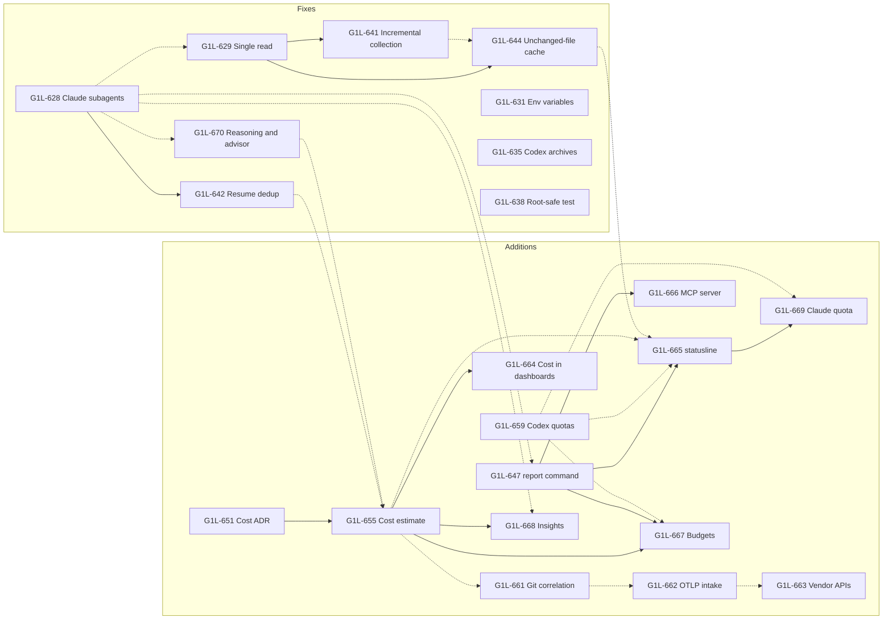

# October 2026 review backlog

This is a dated snapshot of the work planned after the October 2026 product and
competitive review of version 0.4.5 (commit `98dd3c6`). The
[CLI Consumption Linear project](https://linear.app/g1lom/project/cli-consumption-b84515055d16)
remains the source of truth for status, priority, and progress. Update Linear, not this
file, as work moves.

Parent issue: [G1L-625](https://linear.app/g1lom/issue/G1L-625).

The review compared the project with ccusage, CodeBurn, CodexBar, tokscale, agentsview,
Claude-Code-Usage-Monitor, ccstatusline, native OpenTelemetry telemetry, and vendor
admin analytics APIs. This backlog covers its "fix" and "add" findings. Proposals to
remove or merge existing components are deliberately out of scope.

## Evidence gathered during the review

- Python suite: 525 passed, 12 skipped, 1 failed only when run as root; 89% coverage.
- A real Claude Code store collected 1.56M tokens while ignoring about 0.53M tokens
  stored in a subagent transcript (about 25% undercount).
- The Claude adapter charged 1,601,398 bytes to the read budget for 800,699 bytes on
  disk (ratio 2.0), halving the effective 512 MiB provider read limit.

## Fixes

| Issue | Priority | Summary | Blocked by |
| --- | --- | --- | --- |
| [G1L-628](https://linear.app/g1lom/issue/G1L-628) | High | Collect Claude Code subagent transcripts (`<session>/subagents/agent-*.jsonl`). | — |
| [G1L-629](https://linear.app/g1lom/issue/G1L-629) | High | Read each Claude Code file once instead of twice against the byte budget. | — |
| [G1L-641](https://linear.app/g1lom/issue/G1L-641) | High | Extend bounded incremental collection beyond Codex, starting with Claude Code. | G1L-629 |
| [G1L-631](https://linear.app/g1lom/issue/G1L-631) | Medium | Honor environment variables that relocate provider stores. | — |
| [G1L-635](https://linear.app/g1lom/issue/G1L-635) | Medium | Verify and collect archived Codex sessions. | — |
| [G1L-642](https://linear.app/g1lom/issue/G1L-642) | Medium | Avoid double counting across resumed or forked Claude Code sessions. | G1L-628 |
| [G1L-644](https://linear.app/g1lom/issue/G1L-644) | Medium | Skip unchanged provider files between collections. | G1L-629 |
| [G1L-670](https://linear.app/g1lom/issue/G1L-670) | Medium | Count Claude Code reasoning tokens and advisor iterations. | — |
| [G1L-638](https://linear.app/g1lom/issue/G1L-638) | Low | Make the read-only WAL extraction test reliable as root. | — |

## Additions

| Issue | Priority | Summary | Blocked by |
| --- | --- | --- | --- |
| [G1L-647](https://linear.app/g1lom/issue/G1L-647) | High | Terminal `report` command and one-command first run. | — |
| [G1L-651](https://linear.app/g1lom/issue/G1L-651) | High | ADR: decide the cost-estimate framework. | — (accepted, [ADR 0008](../decisions/0008-estimated-cost.md)) |
| [G1L-655](https://linear.app/g1lom/issue/G1L-655) | Medium | Estimated cost from versioned, bundled pricing. | G1L-651 |
| [G1L-664](https://linear.app/g1lom/issue/G1L-664) | Medium | Estimated cost in dashboards, share-safe mode, and exports. | G1L-655 |
| [G1L-659](https://linear.app/g1lom/issue/G1L-659) | Medium | Codex quota and rate-limit windows. | — |
| [G1L-666](https://linear.app/g1lom/issue/G1L-666) | Medium | Read-only MCP server exposing usage aggregates. | G1L-647 |
| [G1L-661](https://linear.app/g1lom/issue/G1L-661) | Medium | Correlate usage with local git activity counters. | — |
| [G1L-665](https://linear.app/g1lom/issue/G1L-665) | Low | Claude Code `statusline` command. | G1L-647 |
| [G1L-669](https://linear.app/g1lom/issue/G1L-669) | Low | Record Claude Code quota received by the status line. | G1L-665 |
| [G1L-667](https://linear.app/g1lom/issue/G1L-667) | Low | Usage budgets and alerts. | G1L-647, G1L-655 |
| [G1L-668](https://linear.app/g1lom/issue/G1L-668) | Low | Usage optimization insights. | G1L-655 |
| [G1L-662](https://linear.app/g1lom/issue/G1L-662) | Low | Receive OpenTelemetry metrics in the collector. | — |
| [G1L-663](https://linear.app/g1lom/issue/G1L-663) | Low | Import vendor admin APIs (Anthropic, GitHub Copilot, Cursor). | On hold |

## Dependency graph

Solid arrows are blocking relations recorded in Linear. Dotted arrows are related
issues that improve each other without blocking.

## Decisions recorded on 2026-10-09

1. **Cost estimates are accepted.** See [ADR 0008](../decisions/0008-estimated-cost.md).
   G1L-655, G1L-664, G1L-667, G1L-668, and cost per commit in G1L-661 are unblocked.
2. **Upstream formats were verified.**
   - Codex moves archived rollouts to `$CODEX_HOME/archived_sessions/`
     (`codex-rs/rollout/src/lib.rs` and
     `codex-rs/thread-store/src/local/archive_thread.rs` at commit `2f761ae`).
   - Codex persists `token_count` events with `rate_limits` (primary and secondary
     windows with `used_percent`, `window_minutes`, and `resets_at`).
   - Claude Code transcripts contain no quota data. The status line receives
     `rate_limits.five_hour`, `seven_day`, and `spend_limit` on stdin, so Claude Code
     quota capture moved to G1L-669, blocked by the status line (G1L-665).
   - Claude Code copies responses into several session transcripts on resume, and
     sidechain files replay parent messages, as documented by ccusage at commit
     `c4fd2e8`. A direct local reproduction was not run.
   - The same review found that Claude Code reasoning tokens and advisor iterations
     are ignored (G1L-670), and that legacy flat `agent-*.jsonl` files can displace
     their parent session during selection (G1L-628).
3. **User identity is accepted as optional and off by default.** It must be documented
   in `docs/privacy.md` before it ships. See
   [ADR 0009](../decisions/0009-optional-identity-and-integrations.md).
4. **The MCP SDK and OTLP decoding dependencies are accepted** as optional extras
   (ADR 0009).
5. **Incremental collection switches on automatically** when an aggregate limit is
   exceeded. An explicit `--no-incremental` option forbids it (G1L-641).

## Follow-up decisions recorded on 2026-10-09

- **Replicated calls (G1L-642).** Deduplicate at reporting time with a hashed
  `dedup_key` and earliest-owner window, not during ingestion. See
  [ADR 0010](../decisions/0010-replicated-model-call-deduplication.md).
- **Git counters (G1L-661).** Read on the machine that holds the repository, label by
  normalized `origin` URL, and count each commit once through a truncated SHA-256
  fingerprint ([ADR 0009](../decisions/0009-optional-identity-and-integrations.md)).
- **OTLP and files (G1L-662).** Files stay authoritative for tokens; OTLP token metrics
  matching a collected `session.id` are excluded, and OTLP supplies the metrics files
  lack (ADR 0009).
- **Vendor admin APIs (G1L-663).** On hold until a team need appears; if resumed, start
  with the Anthropic Claude Code Analytics API only.
- **MCP labels (G1L-666).** Detailed labels by default, share-safe as an option, and a
  privacy note that MCP results reach the model provider (ADR 0009).

No decision blocker remains. G1L-663 is deferred by choice.

## Suggested order

1. Claude Code correctness: G1L-628, then G1L-629, G1L-670, and G1L-642.
2. Collection robustness: G1L-641, G1L-631, G1L-635, G1L-644, G1L-638.
3. G1L-647, and in parallel the G1L-651 decision, then G1L-655 and G1L-664.
4. G1L-659, G1L-665, G1L-669, G1L-666, G1L-661.
5. G1L-662, G1L-663, G1L-667, G1L-668.
